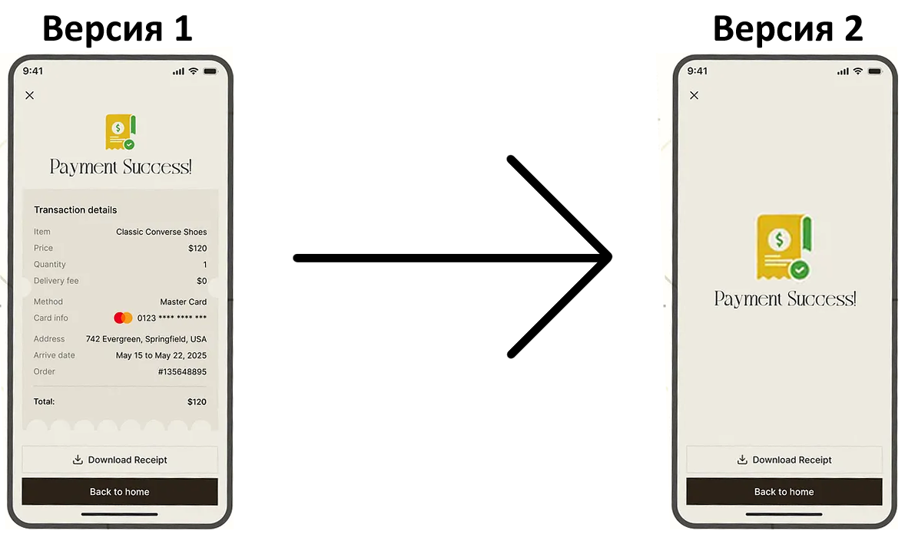

## A/B тестирование - изменение экрана покупки на маркетплейсе (аналог Ozon, Wildberries
### Продуктовая гипотеза: 
Если мы изменим экран покупки, то конверсия в покупку после первой увеличится на 10%, с 30% до 40%.
### Выводы
Нулевая гипотеза о том, что нет никакой разница между экранами покупки была отклонена, так как `p-value = 0.13*0.1^158` (при нормальном распределении находится на 99.999... процентиле), что для такого маркетплейса в России - увеличение выручки от 10 млрд рублей в год.
### Метод теста
Нулевая гипотеза - экран покупки никак не повлияет на конверсию повторной покупки.   
Альтернативная гипотеза - Если мы изменим экран покупки, то конверсия в покупку после первой увеличится на 10%, с 30% до 40%.    

Для проверки двух выборок (контрольной группы и группы теста) с критериями категорий (купили - не купили):
  
1. с мощностью (шансом увидеть ожидаемый эффект) - **80%**,
2. средним распределения нулевой гипотезы **30%**,
3. минимальным наблюдаемым эффектом **1%**,
4. вероятностью ошибки первого рода (ложное отклонение нулевой гипотезы) **5%**,   
требуется размер выборки **52416** пользователей, по **26208** в каждой группе.

Для подобной платформы такую выборку можно собрать за 1 день, но лучше округлить до двух недель, потихоньку раскидывая версии пользователям по **3744** раза в день.

Структура данных:  
`user_id` типа `int`: (0 - 52415) - id пользователя  
`timestamp` типа timestamp(pandas): (2025-09-01 - 2025-09-15) - дата захода на сайт  
`group` типа str: (test, contol) - группа теста, контрольная либо тестовая  
`converted` типа int: (0,1)  

### Тип теста:
z-тест 2 независимых пропорций (`proportion z-test`).   
[Описание теста можно найти тут.](https://en.wikipedia.org/wiki/Two-proportion_Z-test)    

Тест показал: `Z-статистика: 26.84, P-value: 1.1362115314233982e-158 или 1.14/(10^158)`

Среднее по второй группе на 26.8 стандартных отклонений больше чем в первой, с крайне малым шансом сделать ошибку первого рода. **Результат не случаен**, выводы правильны на 99.9999%, можно делать изменения на весь сайт.
